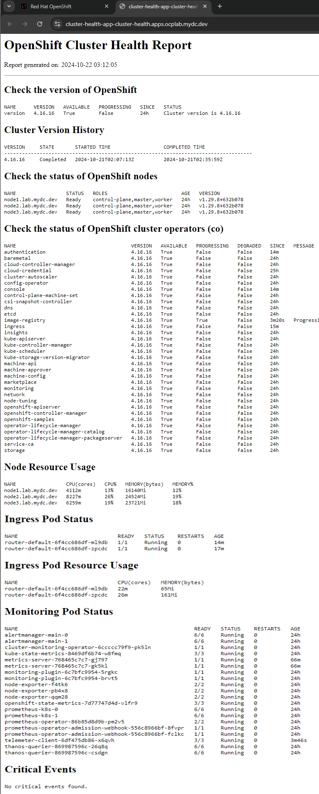

OCP Cluster Health Report
==========================

The OCP Cluster Health Report provides a modern, visually appealing web-based health check dashboard for monitoring OpenShift cluster health. This quickstart guide will walk you through installing the cluster-health PHP application using a provided YAML configuration file.



Features
--------

The redesigned status page includes:

- **Modern Visual Design**: Gradient header, card-based sections, and professional styling
- **Color-Coded Status Indicators**: Green (healthy), yellow (warning), and red (critical) badges for quick status recognition
- **Responsive Layout**: Mobile-friendly design that adapts to different screen sizes
- **Enhanced Data Tables**: Styled tables with hover effects and proper visual hierarchy
- **Status Badges**: Visual indicators for node status, pod status, and operator health
- **Alert Messages**: Clear visual alerts for critical events and system warnings
- **Improved Readability**: Better typography, spacing, and visual organization
- **Professional Appearance**: Clean, modern interface suitable for operations dashboards

Quickstart Installation
-----------------------

To deploy the cluster-health report, run the following command:

```
oc apply -f https://github.com/cragr/ocp-cluster-health/raw/refs/heads/main/cluster-health-app.yaml
```

What the YAML Configuration Does
--------------------------------

The `cluster-health-app.yaml` file sets up the following resources:

1.  **Namespace**: A namespace named `cluster-health` is created to isolate the application's resources.
2.  **Service Account**: A `cluster-health-app` service account is created and assigned `cluster-reader` permissions, allowing the application to read cluster information.
3.  **BuildConfig**: A build configuration is created within the `cluster-health` namespace. It builds a PHP S2I image that includes the OpenShift CLI (`oc`) binary, injecting the files from this repository.
4.  **ImageStream**: An image stream is created to track the built image.
5.  **Deployment**: A deployment with two replicas is configured to run the application. It includes CPU and memory requests and limits, as well as readiness and liveness probes.
6.  **Service and Route**: A service and a route are created to expose the application.

Accessing the Application
-------------------------

Once the build completes, the pods will enter the `Ready` status. The application will be accessible at the following URL:

```
https://cluster-health-app-cluster-health.apps.<cluster_name>.<domain_name>
```

Replace `<cluster_name>` and `<domain_name>` with your OpenShift cluster's details.

Resource Configuration
----------------------

The application is preconfigured with:

-   **Readiness Probe**: Ensures the application is ready to serve traffic.
-   **Liveness Probe**: Monitors the application to ensure it remains healthy.
-   **CPU and Memory Requests/Limits**: Defines resource constraints for stable operation.

Troubleshooting
---------------

If the pods do not enter the `Ready` status, check the build logs and events for any issues:

```
oc logs -f bc/cluster-health-app -n cluster-health
oc get events -n cluster-health`
```

Cleanup
-------

To remove the cluster-health report and all related resources, run:

```
oc delete -f https://github.com/cragr/ocp-cluster-health/raw/refs/heads/main/cluster-health-app.yaml
```
